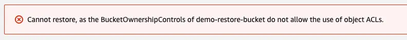

# Access Control Lists (ACLs) must be enabled in the destination bucket

## 概要

- AWS Backup でS3バケットを復元する際に、復元先のS3バケットでACLが有効になっていないとリストアに失敗する。
- [公式のドキュメント](https://docs.aws.amazon.com/ja_jp/aws-backup/latest/devguide/restoring-s3.html#s3-restore-console)にも考慮事項として明記されている。
- S3バケットのACLは無効にする場合が多いので、リストア前後でACLを一時的に有効化する手順と無効化に戻す手順を追加する必要がある。

## リストア失敗時にAWS Backupの画面に出力されるメッセージ

