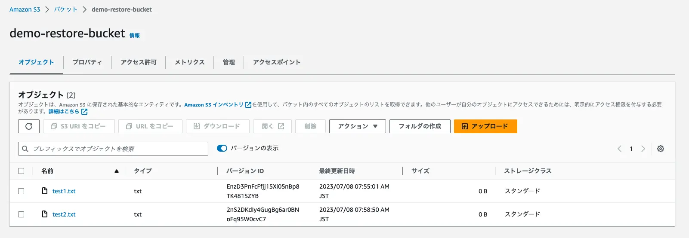

# S3 restore check

## 概要
S3のリストアの動作を確認する

## 確認内容

#### ①オブジェクトのすべてのバージョンも復元されるか
- オブジェクトのすべてのバージョンも復元されると思っていたが復元されるのは最新バージョンのみになる。
- [公式のドキュメント](https://docs.aws.amazon.com/ja_jp/aws-backup/latest/devguide/restoring-s3.html#s3-restore-console)にも制限事項として明記されている。

#### ②バックアップ作成後にオブジェクトを削除/更新/追加した場合、作成したバックアップでバケット全体を復元するとどうなるのか
- 削除されたオブジェクトは復元され、更新したオブジェクトと新しく追加されたオブジェクトには影響は無かった。

## 確認結果

#### ①オブジェクトのすべてのバージョンも復元されるか
1. リストア前のオブジェクト (この状態のバックアップをAWS Backupで作成)

1. オブジェクトを全て削除

1. リストア後のオブジェクト

#### ②バックアップ作成後にオブジェクトを削除/更新/追加した場合、作成したバックアップでバケット全体を復元するとどうなるのか
1. リストア前のオブジェクト (この状態のバックアップをAWS Backupで作成)

1. 既存オブジェクトを削除(test1.txt)、既存オブジェクトを更新(test2.txt)、新規オブジェクトをアップロード(test3.txt)

1. リストア後のオブジェクト

