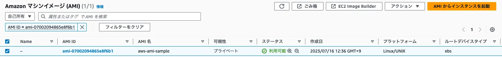
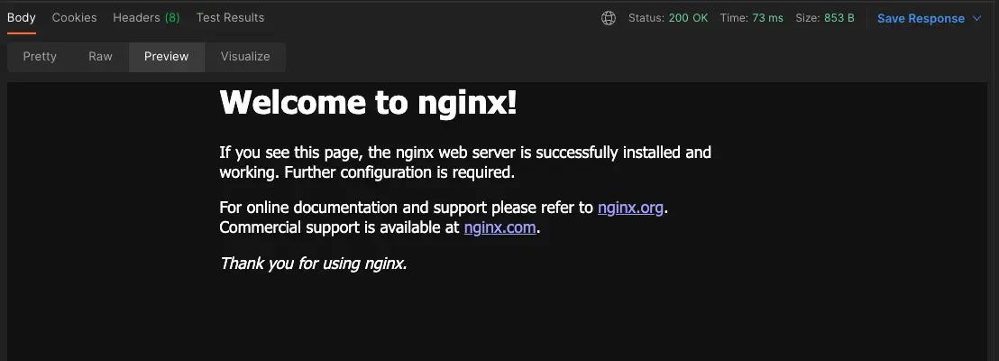

# Install Packer

## Packerとは

Packerは自動化されたイメージビルドを行うためのツール。Packerを使用することで仮想マシンやコンテナイメージを簡単かつスムーズにビルドすることができる。またPackerはクラウドプラットフォームや仮想化プラットフォームに対応しているため様々なプラットフォームでイメージをビルドすることができる。

## 導入環境

- M1 Mac mini (macOS Ventura 13.4.1(c))
- Packer v1.9.1

## インストール

公式サイトを参照

*https://developer.hashicorp.com/packer/downloads*

導入環境ではHomebrewでインストール

```bash
brew tap hashicorp/tap
brew install hashicorp/tap/packer
```

## PackerでAmazonマシンイメージ (AMI)を作成

試しにNGINXインストール済みのAmazon Linux 2のAMIを作成する。

まずはPackerテンプレートを作成する。ファイル名は`aws-ami.pkr.hcl`。

`profile`で指定している`packer`は aws configure で設定したプロファイル。検証目的のためにプロファイル`packer`で指定しているIAMユーザーにはAdministratorAccessをアタッチしているが業務で使用する場合は必要な権限のみアタッチすることを推奨。

```
packer {
  required_plugins {
    amazon = {
      version = ">= 1.2.6"
      source  = "github.com/hashicorp/amazon"
    }
  }
}

source "amazon-ebs" "aws-ami-sample" {
  profile       = "packer"
  ami_name      = "aws-ami-sample"
  instance_type = "t2.micro"
  region        = "ap-northeast-1"
  source_ami    = "ami-05ffd9ad4ddd0d6e2"
  ssh_username  = "ec2-user"
}

build {
  name = "aws-ami-sample"
  sources = [
    "source.amazon-ebs.aws-ami-sample"
  ]

  provisioner "shell" {
    inline = [
      "sudo amazon-linux-extras install -y nginx1",
      "sudo systemctl enable nginx",
      "sudo systemctl start nginx"
    ]
  }
}
```

`packer fmt`コマンドを使用すると作成したテンプレートをフォーマットしてくれる。

```bash
$ packer fmt .
aws-ami.pkr.hcl
```

`packer validate`コマンドを使用するとテンプレートを検証してくれる。

試しに`profile`を`profiles`に変更した状態でコマンドを実行すると以下のように指摘してくれる。

```bash
$ packer validate .
Error: Unsupported argument

  on aws-ami.pkr.hcl line 11:
  (source code not available)

An argument named "profiles" is not expected here. Did you mean "profile"?
```

問題がなければ以下のような出力結果になる。

```bash
$ packer validate .
The configuration is valid.
```

`packer init`コマンドでPackerプラグインをインストールする。

```bash
$ packer init .
Installed plugin github.com/hashicorp/amazon v1.2.6 in "/Users/user/.config/packer/plugins/github.com/hashicorp/amazon/packer-plugin-amazon_v1.2.6_x5.0_darwin_arm64"
```

`packer build`コマンドでイメージをビルドする。

```bash
$ packer build aws-ami.pkr.hcl
aws-ami-sample.amazon-ebs.aws-ami-sample: output will be in this color.

〜略〜

Build 'aws-ami-sample.amazon-ebs.aws-ami-sample' finished after 3 minutes 25 seconds.

==> Wait completed after 3 minutes 25 seconds

==> Builds finished. The artifacts of successful builds are:
--> aws-ami-sample.amazon-ebs.aws-ami-sample: AMIs were created:
ap-northeast-1: ami-07002094865e8f6b1
```

AWSマネジメントコンソールを確認するとAMIが作成されている。



作成したAMIでEC2インスタンスを起動。NGINXがインストールされていることが確認できた。


